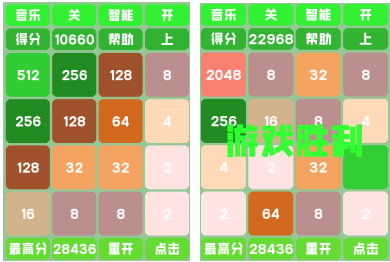
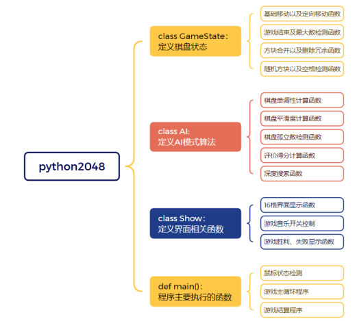
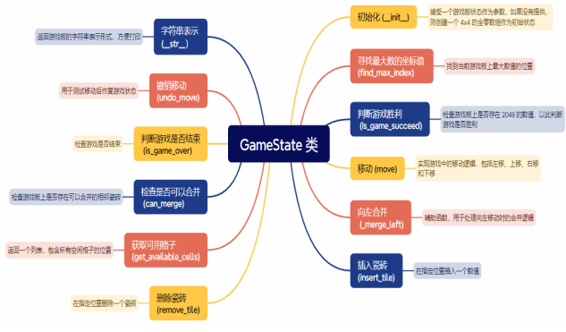
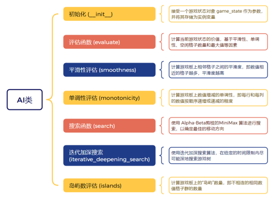
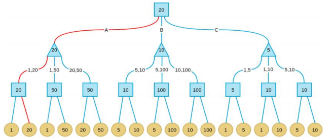
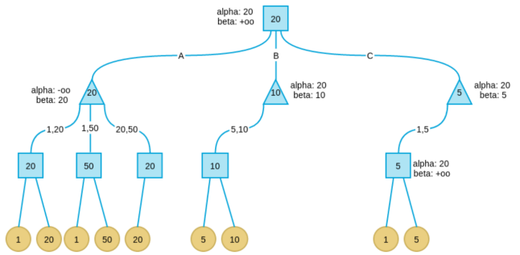

# Python_2048-based-on-Alpha-Beta-pruning-MiniMax
This program mainly designs the player mode and AI mode of Python 2048. The AI mode mainly uses the Alpha-Beta pruning algorithm to implement the 2048 game, bringing users a different gaming experience.

# Python 2048 Game

本项目实现了基于 Alpha-Beta 剪枝的 Minimax 算法的 Python 2048 游戏。

## 1.功能介绍

该项目的主要功能包括：

 **基本游戏规则**：
   - 玩家通过方向键移动数字方块，使相同数字的方块合并，每次合并后获得得分。
   - 当出现 `2048` 数字时游戏胜利。
   - 每次移动后，会在空白区域随机产生 `2` 或 `4`。
   - 若方格被填满则游戏结束。

 **游戏模式**：
   - **正常模式**：玩家自行控制游戏。
   - **提示模式**：显示推荐的移动方向，帮助玩家更好地进行游戏。
   - **人工智能模式**：游戏自动进行，使用 Alpha-Beta 剪枝的 Minimax 算法实现智能决策。

 **增强功能**：
   - **美观性增强**：为不同的数字添加了背景色，优化了积分显示界面。
   - **音效控制**：添加了游戏背景音乐，并且背景音乐进行随机的循环播放设置，同时增添了游戏音效的开关控制。
   - **动态效果**：为游戏的滑块添加了移动动态效果。



- **Python 版本**：3.x
- **依赖库**：
  | 序号 | 库名称      | 版本     | 简介                                         |
  |------|-------------|----------|----------------------------------------------|
  | 1    | os          | 3.12.2   | 操作系统接口，用于文件和目录操作             |
  | 2    | numpy       | 1.26.4   | 高性能数值计算库，支持数组运算               |
  | 3    | copy        | 3.12.2   | 深拷贝和浅拷贝对象                           |
  | 4    | random      | 3.12.2   | 生成伪随机数                                 |
  | 5    | time        | 3.12.2   | 时间相关功能，如延时和计时                   |
  | 6    | pygame      | 2.5.2    | 游戏开发库，支持图形和声音                   |
  | 7    | sys         | 3.12.2   | 访问 Python 解释器的变量和函数               |
  | 8    | math        | 3.12.2   | 数学函数，如三角函数和对数                   |


## 2.开发环境

- **操作系统**：Windows 10/11, MacOS 14/15, Linux 系列
- **开发工具**：PyCharm

## 安装与运行

- **安装依赖库**：

   ```bash
   pip install numpy pygame

## 3.技术实现




## 4.Alpha-Beta剪枝原理
   基于 Alpha-Beta 剪枝的 MiniMax 算法原理：
   a.Minimax 算法的步骤实现是首先确定最大搜索深度 D，D 可能达到终局，也可能是一个中间格局；
   b.在最大深度为 D 的格局树叶子节点上，使用预定义的价值评价函数对叶子节点
价值进行评价；
   c.自底向上为非叶子节点赋值，其中 max 节点取子节点最大值，min 节点取子节点最小值；
   d.每次轮到我方时（此时必处在格局树的某个 max 节点），选择价值等于此 max 节点价值的那个子节点路径


   
   由此，我们借用同样的思想，当前我们需要定义一个评价函数 evaluate 函数，用于对当前棋盘各方块数字分布进行打分。然后，确定最大搜索深度之后，将棋盘在四个方向进行模拟移动，然后使用综合评价函数对四个方向得到的子节点棋盘进行打分，临时记录四个方向的得分数据，再对移动后的子节点棋盘进行模拟移动，循环往复，不断迭代直到规定的迭代深度。


   
   在搜索过程中，算法维护两个边界值：alpha和 beta，其中 alpha 代表当前搜索路径已知的最好选择的下限，而 beta 代表对手可能采取的最佳反击策略的上限。每当搜索到某个节点时，如果发现当前节点的 beta 值小于或等于其父节点的 alpha 值，这意味着从当前节点开始的搜索路径无论如何选择都不会优于已知的最佳路径，因此可以提前终止这条路径的搜索，即进行剪枝。通过这种方式，Alpha-Beta 剪枝有效地减少了搜索空间，提高了搜索效率，使得算法能够在相同时间内探索更深的搜索树，进而找到更优的解决方案。
